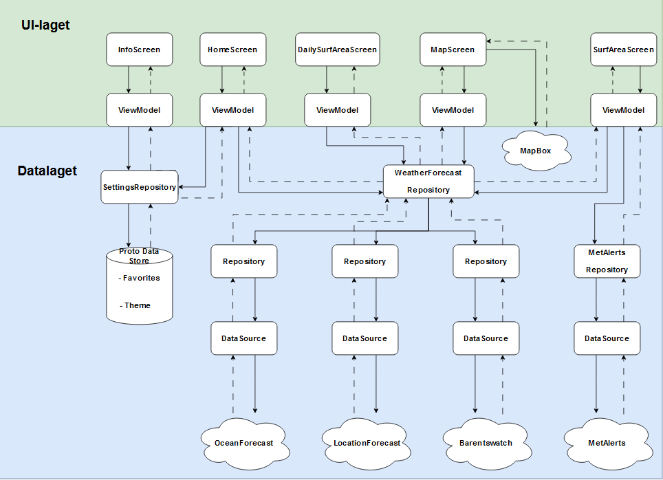

# Arkitektur

Denne filen skal gi innsikt i SmackLip Surfs arkitektur og tilrettelegge for videre drift, vedlikehold og viddereutvikling. 
Den vil gjennomgå det fulgte arkitekturmønsteret, samt redegjøre for hvilke verktøy og teknologier som er tatt i nytte.

## Model-View-Viewmodel

Gjennom prosjektet har vi fulgt arkitekturmønsteret Model-View-Viewmodel, MVVM.
Motivasjonen bak MVVM er å flytte mest mulig logikk ut av UI-koden, og ha et tydelig skille i ansvar, oppsummert av prinsippet Separation of Concerns, SOC.
Et annet sentralt prinsipp i MVVM vi har tatt hensyn til er Unidirectional Data Flow, UDF.
Lagdelingen i MVVM kan beskrives slik: 
*Model* er en samling av komponenter som gjennomfører hoveddelen av det som kalles *forretningslogikk*. Her gjøres API-kall, lagring og tyngre prosessering av data.
*ViewModel* eksponerer dataen fra Model videre til Viewet - det brukeren ser - som en ui-tilstand. Også her må en viss forrentlingslogikk tas i bruk for å omdanne dataen slik Viewet ønsker den.
*View* er det brukeren ser. Jetpack Compose brukes til å lage @Composable funksjoner som skal fremstille tilstanden i Model (via ViewModel).

### Separation of Concerns
MVVM anbefaler et tydelig skille i ansvar fordi det bidrar til oversikt, testbarhet og skalerbarhet. Appen vår gir utrykk for dette på flere måter.
Vi har en tydelig inndelt mappestruktur hvor klasser eller filer plasseres utifra ansvarsområde. 
Data-mappen, tilsvarende *Model* i MVVM inneholder klasser som henter, lagerer eller gjør tyngre prosessering av data. Her finner man *DataSource*- og *Repository*-klasser.
Model-mappen er forbeholdt dataklasser som brukes til deserialisering av API-data. Her vil man også finne dataklasser som generelt bidrar til applikasjonens kode, både som støtte til funksjonalitet og lesbarhet. 
UI-mappen inneholder skjermfunksjoner som er @Composable og skal vises frem til en bruker, samt *ViewModel* (funksjon beskrevet over).

En annen måte vi ivaretar SOC er ved bruk av *Dependency Injection*, spesifikt *Constructor injection*. Klasser er ofte avhengige av referanser til andre klasser, dette kalles 'dependency', eller på norsk, avhengighet. Målet med DI, som gjenspeiles av det objektorienterte prinsippet *lav kobling*, er at klasser i minst mulig grad skal opprette sine egne instanser av avhengighetene sine. Gjennom Constructor Injection mottar de avhengighetene sine som argumenter (KILDE, Android, 2023). Dette bidrar til testbarhet og SOCs andre fordeler ved at man lett kan endre og ha kontroll over instansen en klasse tar i bruk. Vi har tatt ekstra hensyn til det objektorienterte prinsippet *Dependency Inversion*, som er en del av SOLID prinsippene (KILDE), ved at høynivå klasser aldri oppretter sine egne avhengigheter. View mottar Viewmodel-er som argumenter, og ViewModel-er mottar repoisory-er gjennom konstruktøren. I noen lavnivåklasser - som repository-er - har vi tatt en vurdering på at vi ikke bruker DI da avhengighetene deres ikke deles med andre klasser.

Et viktig begrep innen SOC er kohesjon. Høy kohesjon betyr at komponenter har samhørighet i dataen og funksjonene den tilbyr. Dette gir appen uttrykk for ved at den har ett overrordnet Repoitory per kategori av data som eksponeres til ViewModels. I WeatherForecastReposiory har vi samlet data fra 3 API-er som henter værdata, vi argumenterer likevell for at dette ivaretar SOC siden kohesjonen holdes høy da dataen ikke bare er stort sett lik i format, men også bruksområde i appen. Ellers er det en datakilde per API, et reposiory for hver datakilde, en ViewModel per skjerm osv.

### Unidirectional Data Flow
Et annet viktig prinsipp i MVVM er Unidirectional Data Flow, UDF. Dette går ut på at flyten av data gjennom applikasjonen går én retning om gangen. Datalaget sender *state* (tilstand) oppover, og UI-laget sender en *event* (hendelse) nedover. Appen vår gir utrykk for dette ved at datalaget eksponerer en state til ViewModel-er som videre eksponerer en mer tilpasset state til sin brukergrensesnittet hvor den konsumeres. Eventer, som konsekvens av interaksjon med en bruker, sendes ned til ViewModel (eller lengre om nødvendig), hvor staten som presenteres til UI-endres og utspilles i brukergrensesnittet. Dette kan utspillet i appen vår blant annet i Use-caset hvor en bruker legger til et surfeområde i *favoritter*. HomeScreen sier ifra til HomescreenViewModel om eventen, som sendes videre ned til SettingsReposiotry og deretter endrer kildefilene hvor favoritter lagres gjennom Proto Data Store. Endringen sendes da opp igjen der den kom fra til den når skjermen som en endring i tilstand, og oppdaterer skjermen med en ny favoritt.

Et viktig begrep i UDF er *Single Source of Truth*, SSOT. SSOT handler om at all forranding av en bestemt data skjer på ett sted. Dette gjengår i appen vår ved at den aldri oppretter flere enn én instans om gangen av samme ViewModel-klasse eller lignende hvor data oppbevares. I tillegg vil appen aldri direkte endre data utenfor kilden den er lagret i, men sendes nedover til kilden som en event, som beskrevet i eksempelet over. 

## API-nivå og verktøy

### API-nivå
Vi bruker API-nivå XXXXX. Dette er fordi XXXX.

### Verktøy

#### Proto Data Store
Vi bruker Proto Data Store til å generere filer som lagrer favorites og valg av theme slik at dette ikke forsvinner hver gang appen lukkes.

#### Ktor
Ktor brukes til å håndtere HTTP-forespørsler til de brukte API-ene. 
ContentNegotiation brukes for å tillatte mottakelse av data på JSON-format. GSON er brukt til å deserialisere JSON-objekter til kotlink-klasser.
Versjon må jevnlig vedlikeholdes i build.gradle.

#### LocalDateTime
Vi bruker Java Time sitt LocalDateTime API til å behandle tidspunkt i UI-laget. Om appen senere skal tilbys på andre plattformer enn Android må tidspunkt enten håndteres manuelt eller av ett annet tredjepartsbibliotek.

#### MapBox
Hva bruker vi det til, gjerne clarify det med viewmodel og sånn så det ikke ser random ut i skissen.

#### Barentswatch
Vi bruker barentswatch sitt WaveForecast API for å hente bølgeperioder.\
URL: https://www.barentswatch.no/bwapi \
Path: /v1/waveforecastpoint/nearest/all \
API-et krever autentisering gjennom https://id.barentswatch.no/connect/token

#### OceanForecast
Vi bruker METs API OceanForecast for å hente bølgeretning og bølgeperiode.
API-et hentes gjennom en proxy hos IFI ved UIO.

#### LocationForecast
Vi bruker METs API LocationForecast (*complete* varianten) for å hente vindretning, vindhastighet, vindkast, temperatur og værsymboler.
API-et hentes gjennom en proxy hos IFI ved UIO. 

#### MetAlerts
Vi bruker METs API MetAlerts på GeoJSON-format for å hente aktuelle farevarsel.
API-et er hentet gjennom XXXXX grunnet trøbbel med proxy.

