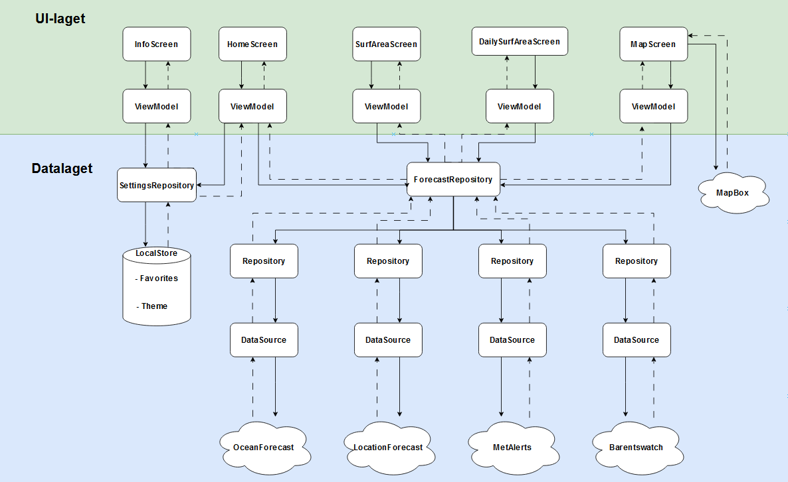

# Arkitektur

Denne filen skal tilrettelegge for videre drift, vedlikehold og viddereutvikling av applikasjonen, og gi innsikt i hvordan den fungerer. 
Den vil gjennomgå arkitekturen vi har brukt så langt, samt redegjøre for hvilke verktøy og teknologier som er tatt i nytte.

## Modern App Architecture

Gjennom prosjektet har vi fulgt androids anbefalinger i *Modern App Architecture*.
Den foreslår mange prinsipper for Android Utvikling, blant annet en reaktiv og lagdelt arkitektur, dependency injection og UDF.

Måten vi har utformet en lagdelt arkitektur på har vært å følge prinsippene bak arkitekturmønsteret Model-View-Viewmodel, MVVM.
Et av disse prinsippene er *Unidirectional Data Flow*, UDF, som beskriver en anbefalt flyt av data gjennom applikasjonens lag.
Det går ut på at *state* eller det som vises til brukeren kun flyter en vei,
og *eventene* som skal utløse endringer i denne staten - ofte som konsekvens av en interaksjon med brukeren - flyter motsatt vei (Android developers, 2023). 
Et viktig begrep i UDF er single source of truth, SSOT, altså at all forrandring av en bestemt type data skjer på ett sted. 
Applikasjonen vår gir utrykk for UDF på flere måter.
Vi har ivaretatt SSOT ved å ha ett reposiotory for hvert API, som gjennom en data source (også spesifikk til APIet) henter dataene appen vår tar i bruk. I tillegg har vi én viewmodel per skjerm.
Dataflyten oppfører seg som UDF foreslår ved at *StateFlows* eksponeres til UI-laget. Disse tas i bruk av viewmodels som lager en UI-state (som også er en StateFlow) som til slutt konsumeres av 
viewet eller skjermen og presenteres til en bruker gjennom Compose-biblioteket. For å ivareta SSOT har ingen deler av UI-laget mulighet til å endre denne dataen direkte, kun presentere den. Dataen som presenteres
vil endres av brukere gjennom å interagere med viewet. Viewet sender da en event ned motsatt vei dataen kom fra, og datalaget reagerer på eventen. For appen vår gjenspeiles dette blant annet i use-caset hvor en bruker la til et surfsted i *favoritter* fra "HomeScreen". Dette sendes som en event fra UIet ned til datalaget, hvor databasen oppdateres med en ny favoritt, som sendes opp igjen til UIet og presenteres som en ny state.

Et annet viktig prinsipp i MVVM er *separation of concerns*, SOC. Dette går ut på at hver komponent i appens struktur har et tydelig, avgrenset ansvarsområde. Appen vår gir utrykk for dette gjennom en mappestruktur hvor filer plasseres enten i en data-, model- eller ui-mappe utifra hvilken funksjon de har. Henting og lagring av data (utenfor applikasjonens livssykel) er forbeholdt data-mappen, fremstilling av data gjøres ved hjelp av dataklasser i model-mappen, og @Composable- eller skjermfunksjoner ligger i ui-mappen. Viewmodels, som også er en del av ui-mappen, gjør den siste delen av forretningsloggikken som er nødvendig for å presentere en state til skjermen den er koblet til. Vi har også veklagt bruk av *dependency injection*, spesifikt *constructor injection* som går ut på at en komponent mottar andre komponenter den er avhengig av gjennom konstruktøren fremfor å opprette en instans selv. Dette gjør at man kan ha én instans av et objekt flere komponenter er avhengig av, istendenfor at alle oppretter sin egen instans, som også bidrar til å opprettholde SSOT. I tilleg gjør dette koden mer testbar siden man enklere kan endre hvilke objekter komponenten tar inn. Vi har gjennomfør dependency injection manuelt fremfor å bruke eksterne rammeverk som Dagger-Hilt.

## Objektorienterte prinsipper

### Lav kobling, høy kohesjon
Kobling beskriver i hvilken grad komponenter har direkte avhengigheter av hverandre. Gjennom dependency injection har vi senket kobling betraktelig, siden komponentene ikke selv trenger å opprette avhengighetene sine. Kohesjon, som beskriver i hvilken grad det er samhørighet i funksjonene en komponent har, har vi forsøkt å holde så høy som mulig. At én viewmodel kun har ansvar for én skjerm, og at én data source henter fra ett API, bidrar til et modulært system hvor komponentene har tydelige roller. Den nevnte mappestrukturen vår bidrar også på å holde oversikt over hvilke komponenter som gjør hva.

### Dependency Inversion Principle
Handler om at høyere nivåmoduler ikke bør avhenge av en instans av et objekt men heller grensesnittet (dette også håndteres med dependecy injection). Bland disse inn over. Det gjør koden mer fleksibel, skalerbar og testbar siden man enkelt kan bytte ut hvilken implementasjon man sender inn som argument (også nevnt over).

## Verktøy og API-nivå

* Proto-data-store
* Kotlinx-serializer, Gson
* LocalDateTime
* MapBox

Vi har valgt API-nivå 26 for å kunne ta bruk av X.

