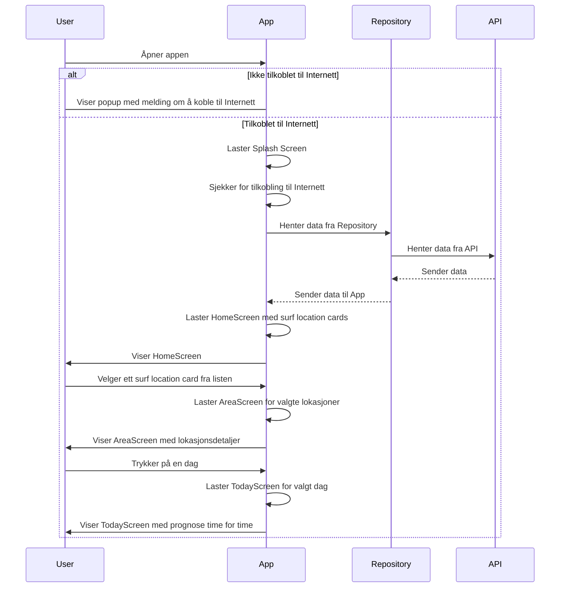

# Modellering

## Use-case
* Brukeren skal sjekke forholdene på en gitt lokasjon på et gitt tidspunkt
#### Primæraktør
* Bølgesurfer
#### Pre-betingelser
* Brukeren har appen lastet ned
#### Post-betingelser 
* Lokasjonen brukeren ønsker å sjekke er tilgjengelig i appen
### Hovedflyt
1. Aktør åpner appen
2. Appen viser SplashScreen
3. Aktør leter etter lokasjonen hen vil sjekke i listen med lokasjoner
4. Aktør trykker på gitt lokasjon
5. Appen viser AreaScreen
6. Aktør velger dag hen vil sjekke
7. Appen viser prognose og forhold time for time

### ALternativ flyt
1. Aktør åpner appen
2. Appen viser at hen ikke er pålogget internett
3. Aktør logger på og går videre, eller sjekker ikke forhold

### Sekvensdiagram




### Aktivitetsdiagram
```mermaid
graph TD;
    Start((Start)) --> Åpner_appen;
    Åpner_appen --> Valg{   };
    Valg -->|Internett_ok| Velg_lokasjon;
    Valg -->|Internett_ikke_ok| Logg_på_nett;
    Velg_lokasjon --> Velg_dag;
    Velg_dag --> Sjekk_forhold;
    Sjekk_forhold --> Slutt((Slutt));
    Logg_på_nett -->|Logget_på| Åpner_appen;
    Logg_på_nett -->|Ikke_logget_på| Slutt;
