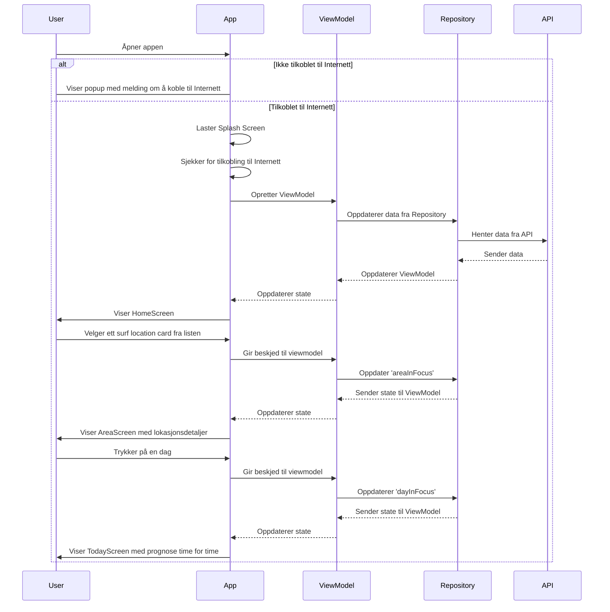
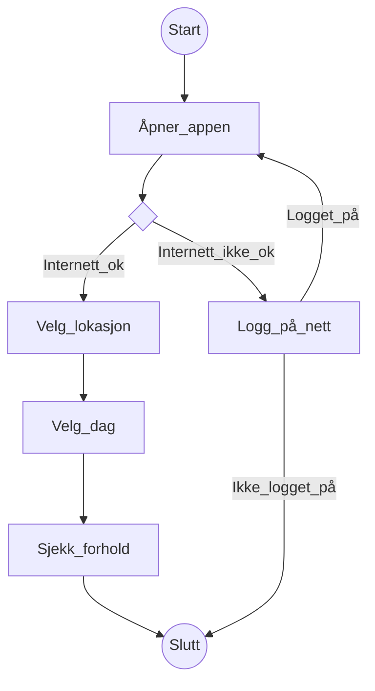
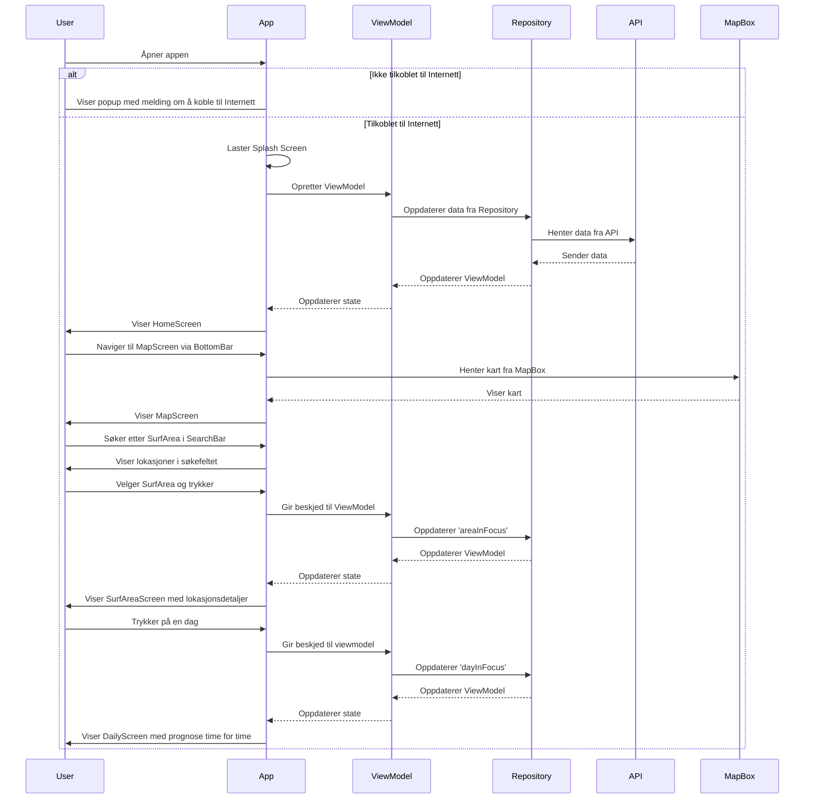
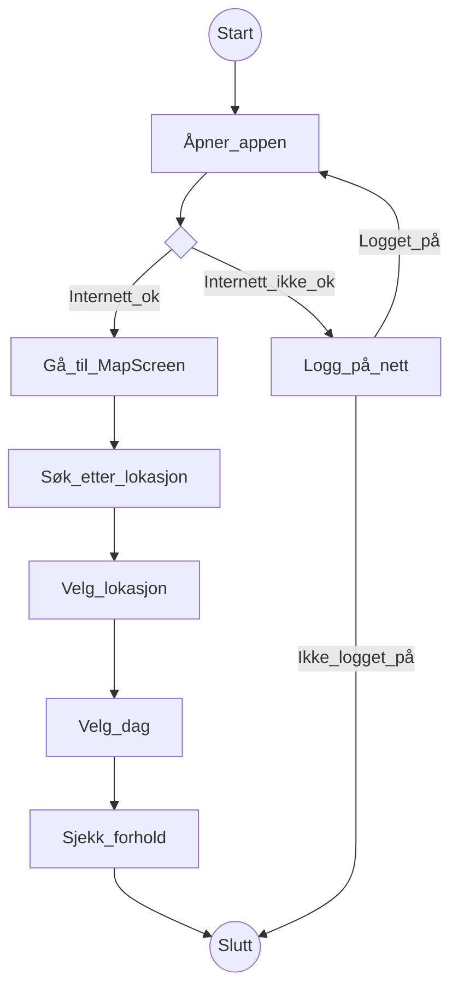

# Modellering

## Klassediagram
Dette er et forenklet klassediagram som viser hva som skjer når bruker åpner appen. Under er informasjon om valg vi har tatt vedrørende klassediagrammet: 
* Vi har abstrahert bort alle data-klasser (inkludert SurfAreas som inneholder informasjonen om surfelokasjonene)
* Vi har abstrahert bort DataSources
* Vi har abstrahert bor OceanForecastrepository, LocationForecastrepository og WaveForecastRepository som bli initialisert i WeatherForecastRepository og ikke har direkte sammenheng med en ViewModel

ng med en ViewModel

## Use-case 1 for Sekvens- og Aktivitetsdiagram
* Brukeren skal sjekke forholdene på en gitt lokasjon på et gitt tidspunkt
#### Primæraktør
* Bølgesurfer
#### Pre-betingelser
* Brukeren har appen lastet ned
* Brukeren må ha muligheten til å koble seg på internett
#### Post-betingelser 
* Lokasjonen brukeren ønsker å sjekke er tilgjengelig i appen
### Hovedflyt
1. Aktør åpner appen
2. Appen viser SplashScreen
3. Aktør leter etter lokasjonen hen vil sjekke i listen med lokasjoner
4. Aktør trykker på gitt lokasjon
5. Appen viser AreaScreen
6. Aktør velger dag hen vil sjekke
7. Appen viser prognose og forhold time for time

### ALternativ flyt
1. Aktør åpner appen
2. Appen viser at hen ikke er pålogget internett
3. Aktør logger på og går videre, eller sjekker ikke forhold

### Sekvensdiagram 1

### Aktivitetsdiagram 1

## Use-case 2 for Sekvens- og Aktivitetsdiagram
* Brukeren sjekker forhold fra SearchBar i MapSreen
#### Primæraktør
* Bølgesurfer
#### Pre-betingelser
* Brukeren har appen lastet ned
* Brukeren må ha muligheten til å koble seg på internett
#### Post-betingelser
* Lokasjonen brukeren ønsker å sjekke er tilgjengelig i appen
### Hovedflyt
1. Aktør åpner appen
2. Appen viser SplashScreen
3. Aktøren navigerer til MapScreen via BottomBar
4. Aktør Søker etter lokasjonen i Searchbar
5. Aktør trykker på lokasjonen i SearchBar
6. Appen (MapBox) "flyr" til lokasjonen
7. Aktør trykker på gjeldende pil
8. Appen viser kortet med informasjon om lokasjonen
9. Aktør trykker på "gå til" knapp
10. Appen viser AreaScreen fot valgt lokasjon
11. Aktør velger dag hen vil sjekke
12. Appen viser prognose og forhold time for time
### ALternativ flyt
1. Aktør åpner appen
2. Appen viser at hen ikke er pålogget internett
3. Aktør logger på og går videre, eller sjekker ikke forhold

### Sekvensdiagram 2

### Aktivitetsdiagram 1

## Use-case diagram
Use-caset tar for seg begge use-casene forklart over

