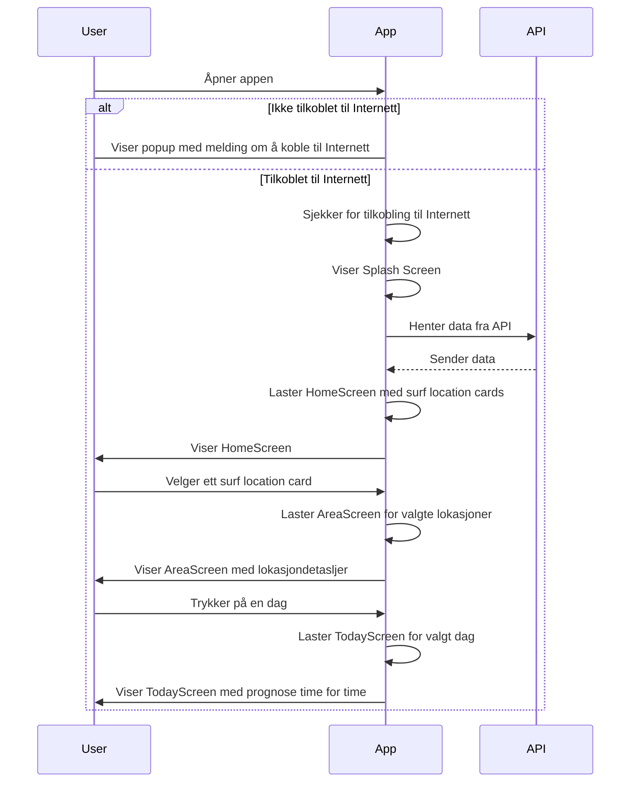

#Sekvensdiagram


#


#Aktivitetsdiagram
```mermaid
graph TD;
    Start((Start)) --> Åpner_appen;
    Åpner_appen --> Valg{   };
    Valg -->|Internett_ok| Velg_lokasjon;
    Valg -->|Internett_ikke_ok| Logg_på_nett;
    Velg_lokasjon --> Velg_dag;
    Velg_dag --> Sjekk_forhold;
    Sjekk_forhold --> Slutt((Slutt));
    Logg_på_nett -->|Logget_på| Åpner_appen;
    Logg_på_nett -->|Ikke_logget_på| Slutt;
